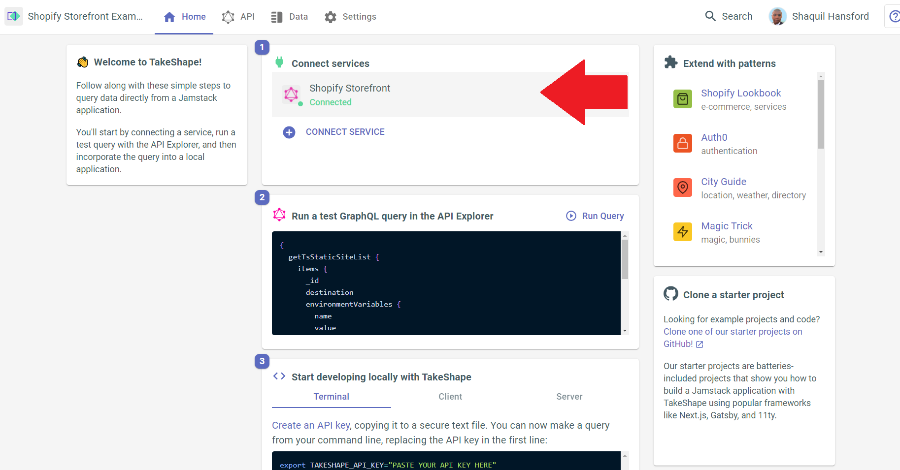

# Shopify Storefront

Using the Shopify Storefront API with TakeShape is a simple way to add checkout and cart functionality to your projects. 

This pattern sets up a basic Shopify Storefront configuration that fetches product and collection data, and creates customers, carts and checkouts.

It also uses our API Indexing feature to cache product and collection data in TakeShape. With API Indexing, you can fetch your data from TakeShape much faster than Shopify can return it, and without hitting Shopify's strict rate limits. Learn more about this feature in [our API Indexing guide](https://app.takeshape.io/docs/schema/api-indexing-guide/).

> New to TakeShape? We provide an all-in-one backend service for headless e-commerce stores. Connect your e-commerce APIs to your TakeShape project, join their data with custom content stored in your TakeShape database, and fetch and mutate it all with a GraphQL API that TakeShape generates for you. No coding required! [Sign up now for free](https://app.takeshape.io/signup?utm_source=shopify_storefront_pattern) to get your backend up and running in minutes.

## How to use this pattern

1.  Click the **Deploy** button below to create a TakeShape project with the pattern in this repo:

    

2. In the **Home** tab of your project dashboard, select **Shopify Storefront** in the service list.

3. You will be taken to the Shopify Storefront Service page.
    - In the **Endpoint** field, add your Storefront API URL, which should look like `https://your-shop-name-here.myshopify.com/api/2022-01/graphql.json`. 
    - Under **Authentication**, add `X-Shopify-Storefront-Access-Token` to the **Header** field, and add your Shopify Storefront Access Token to the **Token** field ([follow Shopify's instructions to get one](https://www.shopify.com/partners/blog/17056443-how-to-generate-a-shopify-api-token))
    - Select Save in the top-right.
    - Select **Cancel** for any modals that popup after your service is connected.

4. You can now query for Shopify Storefront products and collections.
    - Want to add more queries? Navigate to the **API** tab and open the **Patterns & Services** panel on the left side. Hover your cursor over the Shopify Storefront service and select the three dots that appear. Select **Add Queries/Mutations**, and search for the queries or mutations you'd like to add to the pattern.

    

5. You can also fetch indexed data with the `listIndexedShopifyStorefrontCollections` and `listIndexedShopifyStorefrontProducts` queries. If these queries return no data, your products and collections may not have successfully been indexed yet. Navigate to the **Shopify Storefront** service in the **Patterns & Services** panel on the left side of the page. Scroll down until you see the **ReIndex Data** button. Select it to retry indexing your data.
    
    - Having issues with indexing? Check out [our API Indexing guide](https://app.takeshape.io/docs/schema/api-indexing-guide/).

6. You now have a TakeShape project with the Storefront API and TakeShape's API Indexing configured. Learn more about how you can extend your ecommerce data by checking out [our docs on TakeShape's data modeling](https://app.takeshape.io/docs/data/modeling). Learn how to configure your shapes from your project schema by diving into [our schema spec reference](https://app.takeshape.io/docs/schema/spec#shapes).